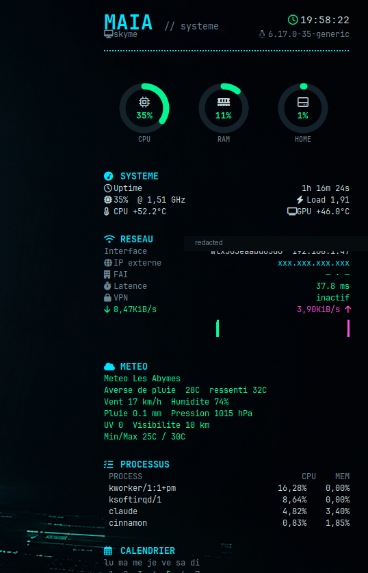

# 🛰️ MAIA Conky

Un **conky** soigné au style cyberpunk (cyan / vert / magenta) pour Linux — pensé pour Linux Mint Cinnamon, fonctionne sur la plupart des bureaux X11.



## ✨ Fonctionnalités

- **3 jauges circulaires** (Cairo/Lua) CPU · RAM · disque, avec couleur dynamique selon la charge (vert → cyan → magenta)
- **Système** : uptime, fréquence, load, **températures CPU/GPU** (`lm-sensors`)
- **Réseau** : interface, IP locale, **IP externe + pays + FAI**, **latence ping**, **état VPN** (tun/wg/proton), graphes ↓/↑
- **Météo précise** géolocalisée (via [wttr.in](https://wttr.in))
- **Top processus** + **mini-calendrier** du mois (jour courant surligné)
- Icônes **Nerd Font**

## 📦 Dépendances

```bash
sudo apt install conky-all lm-sensors jq curl
sudo sensors-detect   # (une fois, pour les températures)
```

Police : **JetBrainsMono Nerd Font** → https://www.nerdfonts.com/font-downloads
(à placer dans `~/.fonts/` puis `fc-cache -f`).

> Conky doit être compilé avec le support **Lua + Cairo** (c'est le cas de `conky-all`).

## 🚀 Installation

```bash
git clone git@github.com:Kdl-Tech/maia-conky.git
cd maia-conky
./install.sh
```

L'installateur copie les fichiers dans `~/.config/conky/` et `~/.local/bin/`,
ajuste les chemins, puis lance conky. Pour le démarrage automatique, voir la fin du script.

Lancement manuel :

```bash
conky -c ~/.config/conky/maia.conf
```

## 🎨 Harmonisation du bureau (Cinnamon)

Un script optionnel accorde **le panneau (barre) et les icônes** au thème du conky
(fond `#060B0E`, accent cyan `#00E5FF`, vert `#00FF99`) :

```bash
./desktop/install-desktop.sh
cinnamon --replace &   # recharger pour tout voir
```

Il agit **sans toucher aux thèmes système** (forks dans `~/.themes` et `~/.local/share/icons`),
crée un backup horodaté et est idempotent :

- **Barre** → fond sombre semi-transparent + **liseré cyan** (thème `Maia-Aqua`, fork de `Mint-Y-Dark-Aqua`)
- **Bouton menu** → icône **anneau néon cyan** (`desktop/icons/maia-menu-ring.svg`)
- **Dossiers** → recoloriés **cyan** (overlay `Papirus-Maia` héritant de `Papirus-Dark`)

> Prérequis : paquets `mint-themes` (Mint-Y-Dark-Aqua) et `papirus-icon-theme`.

## 🗂️ Structure

| Fichier | Rôle |
|---|---|
| `conky/maia.conf` | Configuration principale du conky |
| `conky/maia-rings.lua` | Moteur des jauges circulaires (Cairo) |
| `bin/maia-weather.sh` | Météo (wttr.in, cache 10 min) |
| `bin/maia-wan.sh` | IP externe / pays / FAI (ip-api, cache 5 min) |
| `bin/maia-cal.sh` | Mini-calendrier du mois (Python) |
| `desktop/install-desktop.sh` | Harmonise panneau + icônes Cinnamon |
| `desktop/icons/maia-menu-ring.svg` | Icône anneau cyan du bouton menu |

## ⚙️ Personnalisation

- **Couleurs** : `color1`/`color2`/`color3` dans `conky/maia.conf`.
- **Météo** : par défaut géolocalisée par IP — elle **suit donc l'IP du VPN** quand il est actif.
  Pour la figer sur ta ville (recommandé si tu utilises un VPN) :
  `export MAIA_WEATHER_LOCATION="Les Abymes"` avant de lancer conky.
- **Position/taille** : `alignment`, `gap_x`, `gap_y`, `maximum_width`.

## 📄 Licence

[MIT](LICENSE) — fais-en ce que tu veux. ✌️
